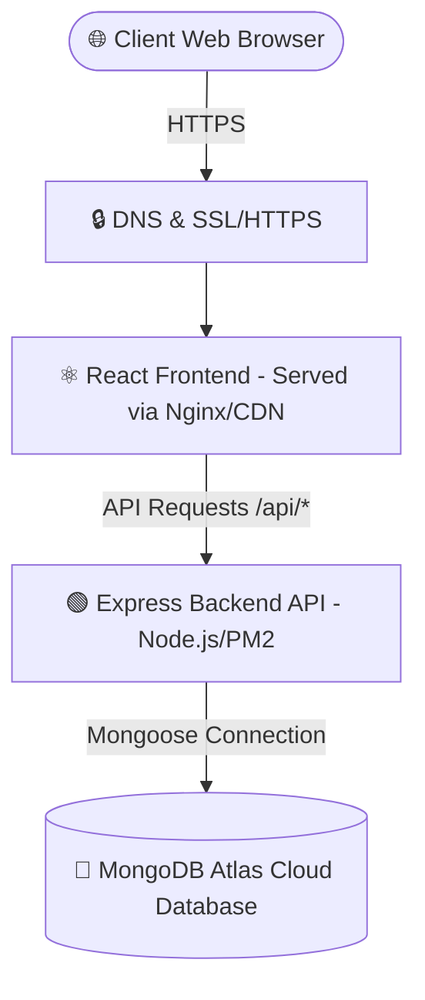
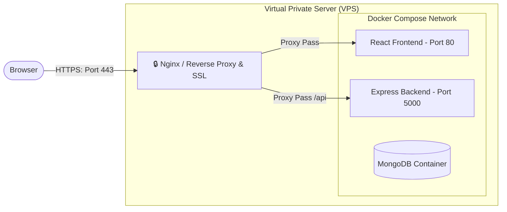

# GigFlow CRM: Enterprise Deployment Guide

This guide details the modern, industry-standard strategies to deploy the complete **GigFlow MERN CRM** application in a production environment. 

Depending on your budget, team scale, and infrastructure preferences, choose one of the three proven deployment strategies outlined below.

---

## 🏛️ Architecture Overview



---

## 1️⃣ Strategy A: Zero-Ops Cloud Platforms (Recommended)
This is the easiest, most cost-effective way to host a modern MERN stack. It separates static frontend rendering from dynamic backend processing.

### 🍃 Step 1: Database Setup (MongoDB Atlas)
1. Sign up for a free account at [MongoDB Atlas](https://www.mongodb.com/cloud/atlas).
2. Create a new Shared Cluster (Free Tier) and select your preferred cloud provider and region.
3. In **Database Access**, create a user with a secure password and `Read and Write to any database` privileges.
4. In **Network Access**, whitelist `0.0.0.0/0` (Allow access from anywhere) to allow your cloud host to connect.
5. Copy your connection string (e.g., `mongodb+srv://<username>:<password>@cluster0.xxxx.mongodb.net/gigflow?retryWrites=true&w=majority`).

### 💻 Step 2: Backend Deployment (Render or Railway)
Deploy the Node/Express backend to **Render** or **Railway** as a Web Service.

#### Using Render:
1. Connect your GitHub repository to Render.
2. Click **New +** > **Web Service**.
3. Configure the following parameters:
   - **Root Directory**: `backend`
   - **Runtime**: `Node`
   - **Build Command**: `npm install && npm run build`
   - **Start Command**: `npm start`
4. Add the following **Environment Variables**:
   - `NODE_ENV`: `production`
   - `PORT`: `5000`
   - `MONGODB_URI`: *[Your MongoDB Atlas Connection String]*
   - `JWT_SECRET`: *[A long, secure random string]*
   - `CLIENT_URL`: *[Your Frontend URL, once created]*
5. Click **Create Web Service**. Render will generate a URL like `https://gigflow-backend.onrender.com`.

---

### 🎨 Step 3: Frontend Deployment (Vercel or Netlify)
Vercel or Netlify is perfect for hosting high-performance, edge-rendered Vite/React frontends.

#### Using Vercel:
1. Log in to [Vercel](https://vercel.com) and click **Add New Project**.
2. Select your repository.
3. Configure the project:
   - **Framework Preset**: `Vite` (Vercel auto-detects this)
   - **Root Directory**: `frontend`
   - **Build Command**: `npm run build`
   - **Output Directory**: `dist`
4. Add **Environment Variables**:
   - `VITE_API_URL`: `https://gigflow-backend.onrender.com` (Your backend URL)
5. Click **Deploy**. Vercel will build and host your frontend on a high-speed CDN.

> [!NOTE]
> Ensure that all API calls inside your React code use the dynamic `VITE_API_URL` environment variable so that requests are routed correctly in production.

---

## 2️⃣ Strategy B: Self-Hosted VPS (Single Machine with Docker Compose)
If you want to keep cloud costs low and host everything (database, frontend, backend) on a single Virtual Private Server (VPS) like DigitalOcean, AWS EC2, or Linode, this is the best option.



### 🛠️ Step-by-Step Guide:

#### 1. Setup the VPS
* Provision a VPS (Ubuntu 22.04 LTS is highly recommended).
* Connect to your VPS via SSH:
  ```bash
  ssh root@your_vps_ip
  ```

#### 2. Install Docker & Docker Compose
Run the following commands on your host server:
```bash
sudo apt update && sudo apt upgrade -y
sudo apt install docker.io docker-compose -y
sudo systemctl enable --now docker
```

#### 3. Clone & Configure the Project
* Clone your codebase onto the server:
  ```bash
  git clone <your-repo-url> /opt/gigflow
  cd /opt/gigflow
  ```
* Create a production `.env` file at the root:
  ```ini
  JWT_SECRET=super_secure_random_production_only_secret_key_123!
  ```

#### 4. Spin up the Containers
Run Docker Compose in detached mode to build and run all services:
```bash
docker-compose -f docker-compose.yml up -d --build
```
This launches:
* **MongoDB** inside a Docker volume.
* **Express API** on port `5000`.
* **React Web App** (compiled with Nginx) on port `80`.

#### 5. Install Nginx and SSL (Certbot) on Host (Optional but Recommended)
To handle domain names and free Let's Encrypt HTTPS certificates:
```bash
sudo apt install nginx certbot python3-certbot-nginx -y
```

Configure Nginx as a reverse proxy `/etc/nginx/sites-available/gigflow`:
```nginx
server {
    listen 80;
    server_name yourdomain.com www.yourdomain.com;

    location / {
        proxy_pass http://127.0.0.1:80; # Points to Frontend Docker Container
        proxy_http_version 1.1;
        proxy_set_header Upgrade $http_upgrade;
        proxy_set_header Connection 'upgrade';
        proxy_set_header Host $host;
        proxy_cache_bypass $http_upgrade;
    }

    location /api {
        proxy_pass http://127.0.0.1:5000; # Points to Backend Docker Container
        proxy_http_version 1.1;
        proxy_set_header Upgrade $http_upgrade;
        proxy_set_header Connection 'upgrade';
        proxy_set_header Host $host;
        proxy_cache_bypass $http_upgrade;
    }
}
```
Enable the site and obtain SSL Certificate:
```bash
sudo ln -s /etc/nginx/sites-available/gigflow /etc/nginx/sites-enabled/
sudo nginx -t
sudo systemctl restart nginx
sudo certbot --nginx -d yourdomain.com -d www.yourdomain.com
```

---

## 3️⃣ Strategy C: VPS Traditional Deployment (No Docker - PM2 + Nginx)
If you do not want to use Docker containers but still want maximum speed and resource utilization on your VPS, you can run services natively using **PM2** (Node Process Manager) and **Nginx**.

### Step 1: Install Dependencies
```bash
# Install Node.js
curl -fsSL https://deb.nodesource.com/setup_20.x | sudo -E bash -
sudo apt-get install -y nodejs

# Install PM2 and Git globally
sudo npm install -y -g pm2
```

### Step 2: Configure & Build Backend
```bash
cd /opt/gigflow/backend
npm install
npm run build # Compiles TypeScript to dist/
```

Start the backend service with **PM2** to ensure it automatically restarts on crashes or server reboots:
```bash
# Add environment variables before launching
MONGODB_URI="mongodb+srv://..." JWT_SECRET="yoursecret" PORT=5000 NODE_ENV=production pm2 start dist/server.js --name "gigflow-backend"
pm2 save
pm2 startup
```

### Step 3: Configure & Build Frontend
```bash
cd /opt/gigflow/frontend
# Edit .env to set API address
echo "VITE_API_URL=https://yourdomain.com/api" > .env
npm install
npm run build # Compiles frontend to 'dist/' folder
```

### Step 4: Configure Nginx to Serve Frontend and Proxy Backend
Create Nginx configuration to directly serve the frontend static files (fastest option) and proxy `/api` traffic:
```nginx
server {
    listen 80;
    server_name yourdomain.com;

    # Serve compiled Frontend React static files directly
    root /opt/gigflow/frontend/dist;
    index index.html;

    location / {
        try_files $uri $uri/ /index.html;
    }

    # Proxy API calls directly to native Express port
    location /api {
        proxy_pass http://127.0.0.1:5000;
        proxy_http_version 1.1;
        proxy_set_header Upgrade $http_upgrade;
        proxy_set_header Connection 'upgrade';
        proxy_set_header Host $host;
        proxy_cache_bypass $http_upgrade;
    }
}
```

---

## 4️⃣ Strategy D: Serverless/Containerized Scale (AWS ECS or GCP Cloud Run)
If you require high availability, autoscaling, and zero server maintenance:

1. **Dockerize**: Build your Docker containers locally or in a CI/CD pipeline (GitHub Actions).
2. **Container Registry**: Push the compiled Docker images to AWS ECR or Google Artifact Registry.
3. **Run Platform**:
   - **Google Cloud Run**: Spin up the backend image. It scales to zero when no traffic exists, keeping costs ultra-low.
   - **AWS ECS (Fargate)**: Deploy backend as a containerized task.
4. **Static Hosting**: Deploy your built `dist` React folder to AWS S3 (and distribute via CloudFront CDN) or Google Cloud Storage.
